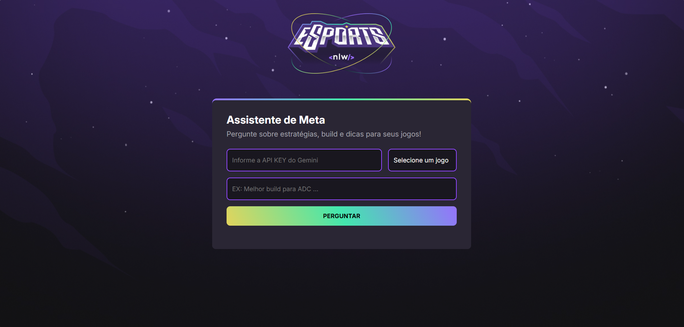

# 🎮 AI Game Meta Assistant – NLW Agents (Rocketseat)


Uma aplicação web que utiliza Inteligência Artificial (Google Gemini) para gerar estratégias atualizadas, builds e dicas para jogos competitivos como League of Legends, Valorant e CS:GO.

Este projeto foi desenvolvido durante o evento **NLW - Agents** promovido pela Rocketseat.

---

## 📸 Preview do projeto

<p align="center">
  
</p>

---

## 🚀 Funcionalidades

* Consulta de estratégias e builds para:

  * League of Legends (LoL)
  * CS:GO
  * Valorant
* Integração com a API do Google Gemini
* Interface moderna e responsiva
* Conversão automática de Markdown para HTML (Showdown.js)
* Exibição dinâmica da resposta da IA
* Prompt personalizado para cada jogo

---

## 🛠️ Tecnologias utilizadas

* HTML5
* CSS3
* JavaScript (Vanilla JS)
* Google Gemini API
* Showdown.js

---

## 🧠 Aprendizados

Durante o desenvolvimento deste projeto eu aprendi:

* Integração com APIs de Inteligência Artificial (Google Gemini)
* Engenharia de Prompt para respostas mais precisas
* Manipulação dinâmica do DOM com JavaScript
* Conversão de Markdown para HTML utilizando Showdown.js
* Estruturação de aplicações Front-End

---

## 🔑 Configuração da API

Para utilizar o projeto, você precisa de uma API Key do Google Gemini.

1. Acesse o Google AI Studio
2. Gere sua API Key
3. Insira no projeto conforme solicitado

⚠️ Nunca compartilhe sua API Key publicamente

---

## 📁 Estrutura do projeto

```
📦 projeto
 ┣ 📂 assets
 ┣ 📂 css
 ┣ 📂 js
 ┗ 📄 index.html
```

---

## 🔧 Como executar o projeto

1. Clone o repositório:

```bash
git clone https://github.com/Lukinhax/NLW-Agents---Rocketseat.git
```

2. Abra o arquivo `index.html`

3. Informe sua API Key do Google Gemini

4. Escolha o jogo

5. Faça sua pergunta e receba a resposta da IA 🚀

---

## 🎯 Objetivo do projeto

Este projeto foi criado com o objetivo de praticar:

* Consumo de API
* JavaScript
* Manipulação de DOM
* Integração com Inteligência Artificial
* Criação de interfaces web responsivas

---

## 📌 Status do projeto

✔️ Finalizado

🚀 Pode receber melhorias futuras

